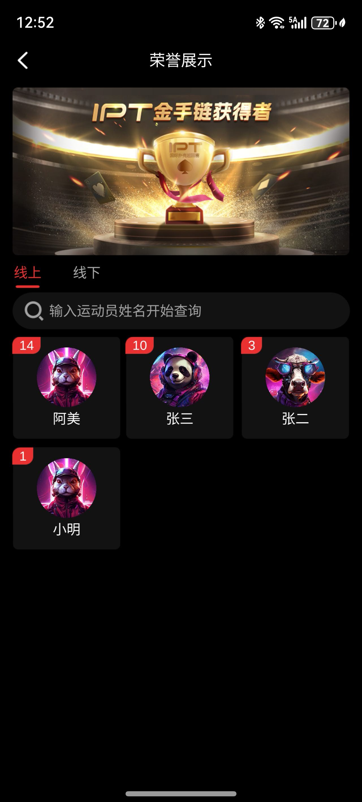
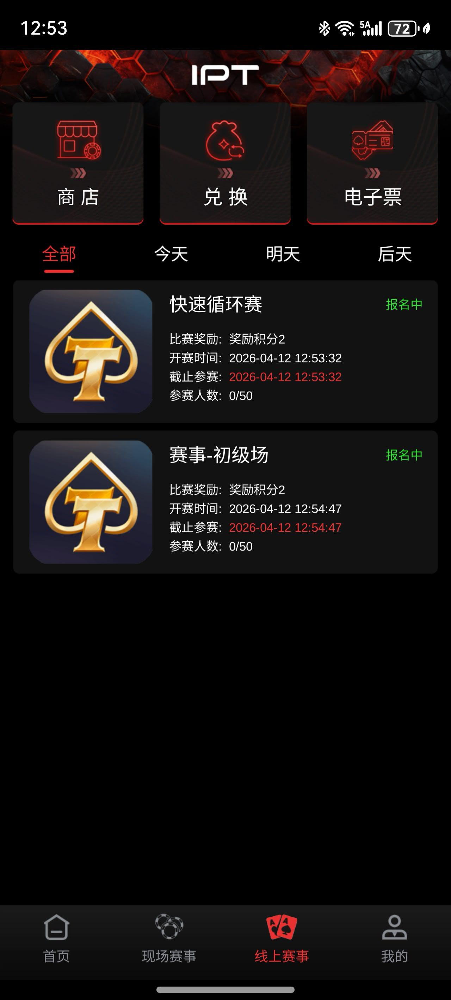
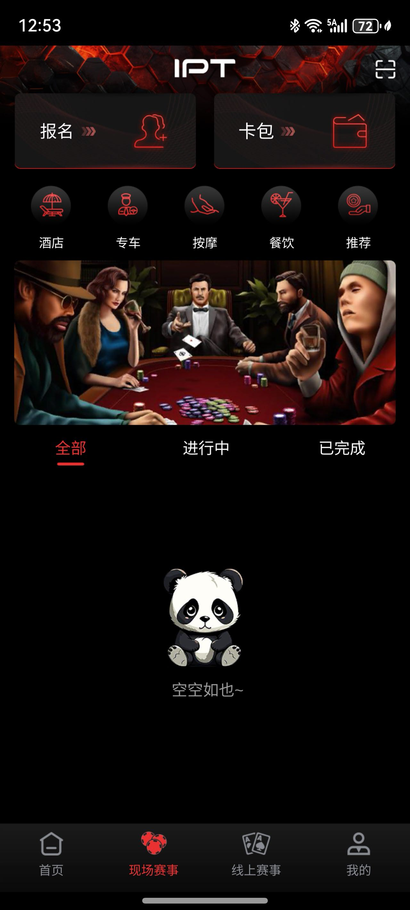
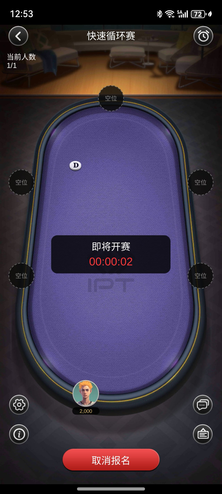
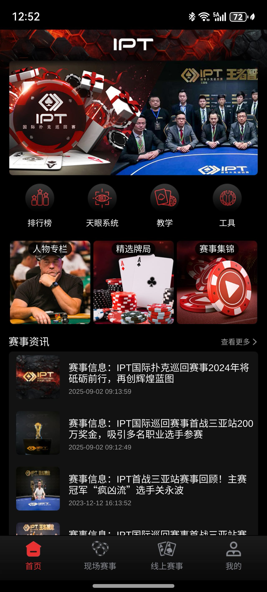
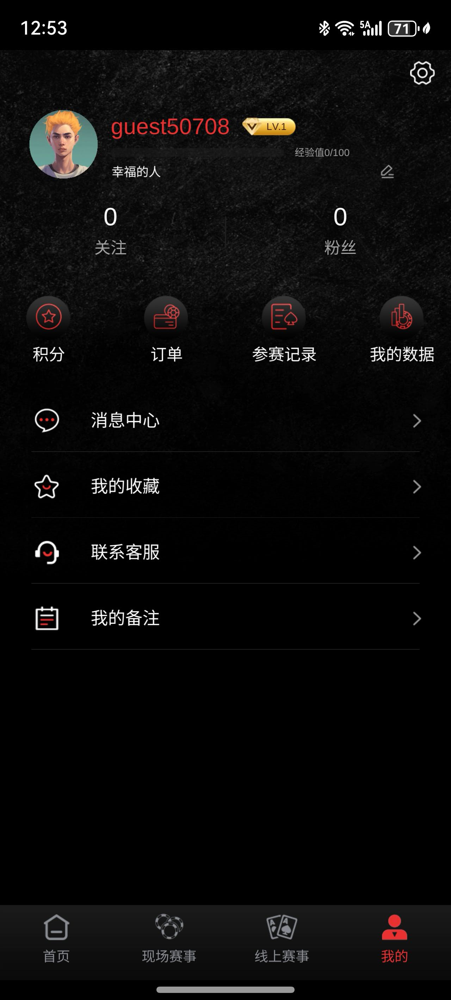
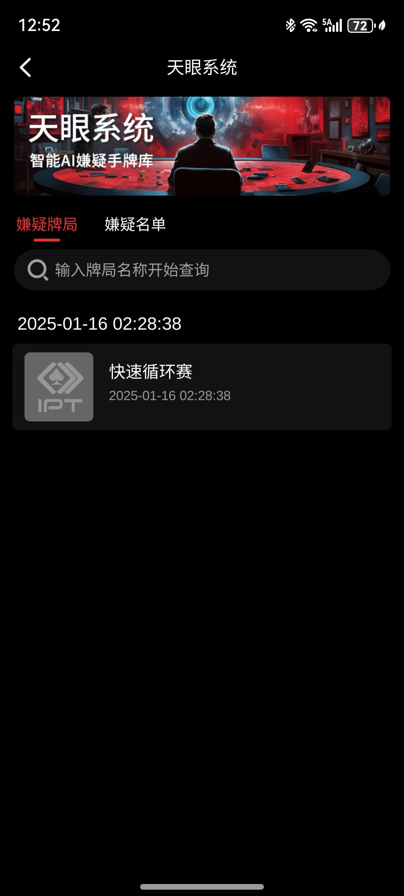

# 🃏 德州扑克源码 | 德州赛事源码 | 德州锦标赛系统| 类似CPG/TJPT | 线上MTT + 线下门票系统

**德州源码 · 德州MTT源码 · 德州俱乐部源码 · 德州联盟源码**  
多人游戏锦标赛系统 | 实时多人德州扑克赛事平台源码（支持 MTT / SNG / 门票系统）

**Texas Hold'em Tournament System** | **Multiplayer Poker Tournament Engine** | MTT / SNG Poker Source Code

## ✨ 项目核心亮点

- **专注赛事系统**：完整支持 MTT 锦标赛、SNG、门票系统、淘汰赛赛制
- **服务器权威架构**：C++ 服务端，所有核心逻辑在服务端执行，防作弊能力强
- **高并发支持**：WebSocket 实时同步，适合大规模赛事场景
- **俱乐部与联盟**：支持德州俱乐部、联盟、私人局等多种运营模式
- **实用功能**：报名系统、门票系统、排名奖励、AI Bot、实时数据统计
- **易扩展**：模块化设计，方便接入现有德州扑克服务端

> **⚠️ 重要声明**：本项目**仅供学习和研究使用**，严格禁止用于任何真实货币赌博。商业使用请自行遵守当地法律法规，作者不承担任何法律责任。

---

## 📸 项目截图（真实界面展示）

---

## 🚀 快速开始

git clone https://github.com/pokerdeveloper/multiplayer-game-tournament-system.git
cd multiplayer-game-tournament-system
详细编译、部署和集成说明请查看 docs/ 目录

## 🎯 产品核心价值

这是一套**专为扑克赛事打造**的完整App源码，功能与模式**高度对标CPG、TJPT等主流赛事平台**。源码来自已停服的成熟商业项目，支持**线上App打门票、参加MTT锦标赛**，并与**线下比赛**完美打通。

*   **完整赛事闭环**：线上打门票 → 线下参赛 → 成绩同步 → 奖励发放。
*   **丰富比赛形式**：支持**线上MTT、SNG、卫星赛、 bounty锦标赛**。
*   **运营工具齐全**：后台可灵活配置门票、赛事结构、奖励。

> 👉 **这就是一套可以让你快速上线一个“CPG类”赛事App的完整源码。下面有真实截图与演示。**

## 🚀 核心功能

| 模块 | 功能说明 |
| :--- | :--- |
| **线上App** | 用户注册、金币/门票系统、多级别MTT赛事、好友对战、排行榜 |
| **赛事引擎** | 支持冻结、急速、赏金、卫星赛等多种比赛结构 |
| **门票系统** | 线上赛门票（直接报名）、线下赛门票（生成二维码/凭证） |
| **线下打通** | 线下比赛扫码核销、成绩录入、线上同步展示 |
| **后台管理** | 赛事创建、门票发放、玩家管理、数据报表 |

## 📸 产品真实截图

| 赛事大厅 | MTT锦标赛 | 门票系统 |
| :---: | :---: | :---: |

## 📈 未来路线图

完善 MTT 完整赛制流程（盲注提升、休息时间等）
增加更多赛事类型和奖励机制
优化高并发与分布式支持
提供 Unity / Web 客户端示例

## 📞 联系方式

Telegram：@alibabama401
Email：ttpoker733@gmail.com

欢迎技术交流、部署咨询或合作讨论。
## 📦 交付物与技术服务

*   **完整源码**：Unity客户端 + C++服务端 + 数据库脚本。
*   **部署支持**：可选**协助你将整套系统部署到你的服务器**。
*   **文档与工具**：API文档、赛事配置教程、后台使用手册。
*   **售后服务**：1年技术答疑与Bug修复支持。

---

## 🔍 关于本仓库的代码文件

> 本仓库当前展示的 `.cpp/.h` 文件，属于**原项目的部分服务端逻辑片段**，仅用于展示代码风格。  
> **完整的赛事App源码（包括完整的Unity客户端、C++服务端、数据库）因体积和授权原因，不在此公开。**  
> **如需查看完整代码结构、文件清单或进行远程演示，请联系我们。**

---

## ❓ 常见问题

**Q：这套源码能直接上线运营吗？**  
A：完全可以。代码完整，我们也可协助部署。已有客户成功上线类似赛事App的案例。

**Q：线上门票如何与线下比赛验证？**  
A：系统包含完整的**线上生成凭证 → 线下扫码核销**流程，并有后台统一管理。

**Q：源码包含CPG/TJPT的所有功能吗？**  
A：我们实现了核心且成熟的赛事流程。具体功能清单可以索取PDF文档进行对比。我们也支持按需二次开发。

**Q：如何保障交易安全？**  
A：支持**合同签署**、**远程演示验证**，并可走双方认可的担保流程。
## ⭐ 支持项目
如果你觉得这个德州赛事源码有帮助，欢迎 Star 支持！
也欢迎 Fork 后二次开发并贡献代码。

再次声明：本仓库为开源学习项目，请遵守当地法律法规，合理使用。

